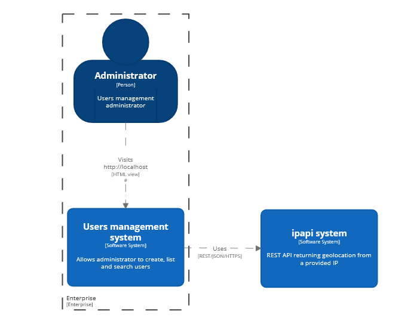

# High-level system overview



## API

### Build 

Using Docker:
```bash
docker run --rm -it -v ~/.m2:/root/.m2 -v $(pwd):/workspace -w /workspace maven:3.6.3-jdk-11 mvn clean package
```

```bash
./mvnw clean package
```

### Tests

Unit tests:
```bash
./mvnw test
```

Integration tests:
```bash
./mvnw integration-test
```

#### Test code coverage

To enable code coverage, simply enable the `code-coverage` Maven profile:
```bash
[...] -Pcode-coverage
```
```bash
./mvnw clean verify -Pcode-coverage
```

### Code formatting

Code formatting is made using `Spotless` through its Maven plugin: `https://github.com/diffplug/spotless/tree/main/plugin-maven`
It is automatically run at the `process-sources`, given the `dev` Maven profile is enabled (by default).
