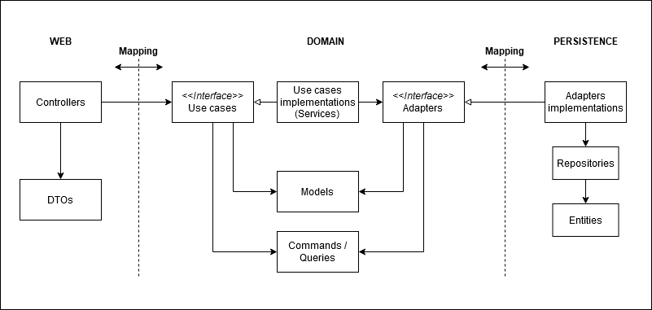

# High-level system overview


## API

### Build 

```bash
./mvnw clean package
```

### Tests

Unit tests:
```bash
./mvnw test
```

Integration tests:
```bash
./mvnw integration-test
```

#### Test code coverage

To enable code coverage, simply enable the `code-coverage` Maven profile:
```bash
[...] -Pcode-coverage
```
```bash
./mvnw clean verify -Pcode-coverage
```

### Code formatting

Code formatting is made using `Spotless` through its Maven plugin: `https://github.com/diffplug/spotless/tree/main/plugin-maven`
It is automatically run at the `process-sources`, given the `dev` Maven profile is enabled (by default).

### Development workflow

To spin up a development environment (`MongoDB` / `RabbitMQ`):
```bash
docker-compose up -d db broker
```

### Run / deploy

#### Hosts setup
Edit your `hosts` file (`/etc/hosts`):

```
127.0.0.1 broker.localhost
127.0.0.1 api.localhost
```

#### Start containers

1. Build the `users-management-api` Docker image (in the `users-management-api` directory):
```bash
./mvnw clean package
```

Set the `APP_USER_CREATION_IP_CHECK_ENABLED` environment variable to `false` to disable IP check on user creation (`docker-compose.yml`)

2. Build the `users-management-ui` Docker image (in the `users-management-ui` directory):
```bash
npm install && npm run build-prod && npm run docker:build
```

3. Run
```bash
docker-compose up -d
```

This `docker-compose.yml` file starts 5 containers:
- Traefik proxy
- REST API server
- MongoDB
- RabbitMQ broker
- UI

4. Access the UI at `http://localhost`

5. Access the API documentation at `http://api.localhost/swagger-ui.html`

You can access the RabbitMQ dashboard at `http://broker.localhost`

### API documentation

You can view Swagger-based API documentation at the following URL:
`http://localhost:8080/swagger-ui/index.html?configUrl=/v3/api-docs/swagger-config`

Or `http://api.localhost/swagger-ui/index.html?configUrl=/v3/api-docs/swagger-config` if you are running the API through its Docker container.

### Metrics

This application exposes some business metrics:
- Number of successful user creations: `/actuator/metrics/users.creation.success`
- Number of unsuccessful user creations: `/actuator/metrics/users.creation.failure`


### Architecture




This project follows the `screaming` architecture: package by feature / functional area / bounded context
    
Advantages:
- Its structure is easy to read (screaming architecture, tells what it does), easy to search for a given use case
- Favors low coupling and high cohesion (bounded context): could easily be migrated to microservices later
- Allows working in parallel: each developer can work on its own feature; no merge conflicts
- SRP (Single Responsibility Principle): updating one feature doesn't interfere with other classes: minors regressions risks

Disadvantages:
- Can be complex/difficult at first glance (a lot of packages/classes)
- Lot of mapping / adapters: can be seen as a lot of duplication, however, it permits high isolation

#### Tests
Architecture tests are implemented by ArchUnit (see `ArchitectureTests` and `CodingRulesTests`)

#### Mapping strategy

Due to its architecture, this project extensively uses mapping through layers with `MapStruct`.
As it's a simple CRUD project, mapping might have been skipped as it needs a lot of boilerplate code.

Such a mapping strategy can bring the following advantages:
- SRP (Single Responsibility Principle): a class should only have one reason to change
- No single entity class containing ORM/JSON/XML annotations
- Clean domain object

### Database choice

`MongoDB`

As there is only one entity involved in this small application, there is no need to use a relational DB.
- Schema can easily evolve
- High throughput


## UI

1. Set proper API URL in `src/app/services/user.service.ts` file (`l.4`) depending on your run configuration (`http://localhost:8080` or `http://api.localhost` using Docker)

2. Build Angular application:
```bash
npm install && npm run build-prod
```

3. Don't forget to set the `APP_USER_CREATION_IP_CHECK_ENABLED` environment variable to `false` if you want to disable IP check on user creation (`docker-compose.yml`)

4. Build `users-management-ui` Docker image (you can also let `docker-compose` build it by adding the `--build` flag to the `docker-compose up` command):
```bash
npm run docker:build
```

5. Run:
```bash
docker-compose up -d
```

Go to `http://localhost`